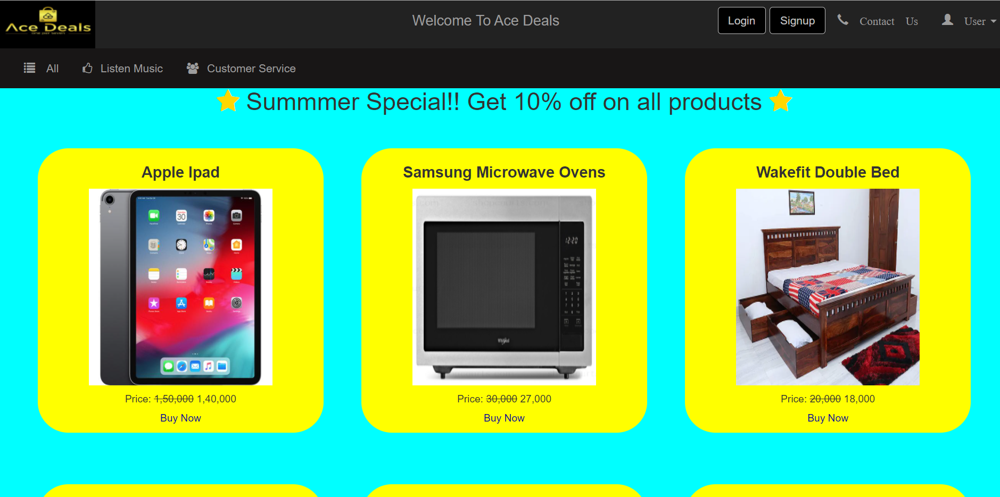
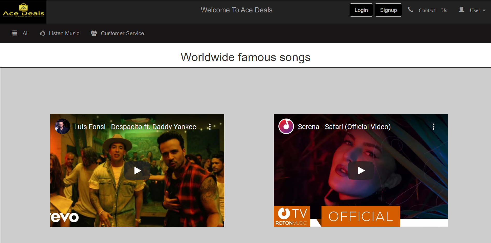

<!--# Dark_Riders-woc_4.0-
This is an E-commerce Website(prototype).
To run this website on your system,there are few things that you have to do
1.Download and install XAMPP Server on your system.
2.Then create a database named as 'darkriders' using myphp admin.
3.After that import the file 'darkriders.sql' on your 'darkrider' data base.
4.Now according to your XAMPP setting you can modify the file '_dbconnect.php'in '\project\partials' file if with  default setting it is not working.-->
<!DOCTYPE html>
<html>
  <head>
    
  </head>
  <body>
    <h1 style = "text-align:center;font-size:1.5vw;font-weight:bold;font-family:arail;">Dark_Riders-WOC_4.0_</h1>
    <h2 style = "text-align:center;font-size:1.5vw;font-weight:bold;font-family:arail;">Welcome To Our Project</h2>
    <h3>Name of Mentor: Saraswati Kumari</h3>
    <h3>Name of Team Members</h3>
    <ul>
      <li>Anurag Sharma</li>
      <li>Akash Kumar Gupta</li>
      <li>Aditya Vikram Singh</li>
      <li>Abhimanyu Prajapati</li>
    </ul>
    <h3>Pre-Requisites For Opening Our Website on Your Laptop</h3>
    <ul>
      <li>Donwload and Install XAAMP Server on Your Computer.</li>
      <a href = "https://www.apachefriends.org/download.html">Link For Download XAAMP</a>
      <li>Start the XAAMP Server.</li>
     <li>Note the port number of MySQL service running on XAAMP and go to _dbconnect.php file and type the port number there like this:"$servername = 'localhost:port number'"</li>
      <li>Now open your browser and type "localhost" in the URL Address bar.</li>
      <li>Click on phpMyAdmin.</li>
      <li>Create a database named darkriders.</li>
      <li>Click on Import button present on right side. A new screen will open up.</li>
      <li>Now click on choose file, browse and select darkriders.sql file</li>
      <li>Now click on Go</li>
      <li>The databas will be imported</li>
      <li>That's All!!! Start browsing our website!!!</li>
    </ul>
    <a href = "https://drive.google.com/file/d/1jGXf4qWFSVQNsjcxYAur4ZdqVoJpgFy_/view"><h3>Link to Video File of Our Website</h3></a>
    <h3>As people say a picture speaks a thousand words so here are some screenshots of our website. Hope You Like it: D</h3>
    
    
    
    
    <h3>Stay Safe and Healthy.Goodbye</h3>
  </body>

