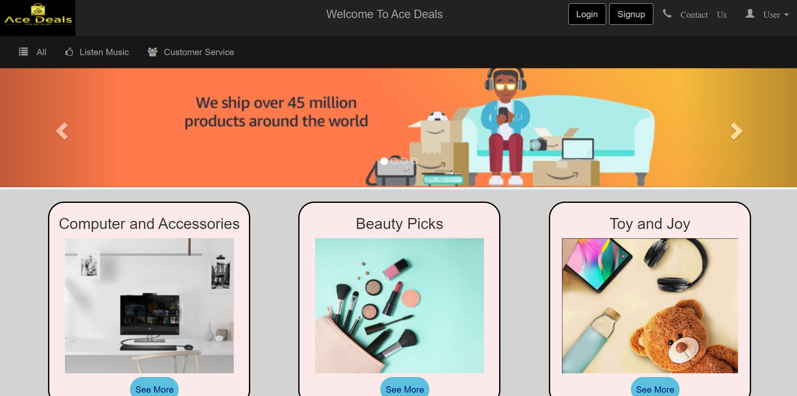
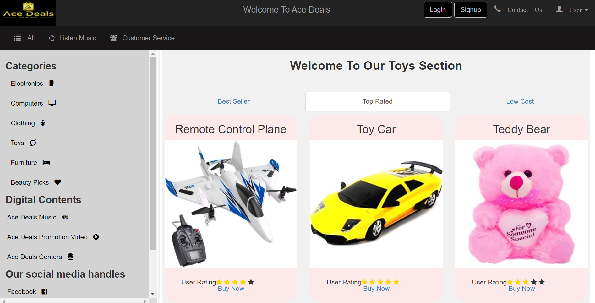

<!--# Dark_Riders-woc_4.0-
This is an E-commerce Website(prototype).
To run this website on your system,there are few things that you have to do
1.Download and install XAMPP Server on your system.
2.Then create a database named as 'darkriders' using myphp admin.
3.After that import the file 'darkriders.sql' on your 'darkrider' data base.
4.Now according to your XAMPP setting you can modify the file '_dbconnect.php'in '\project\partials' file if with  default setting it is not working.-->
<!DOCTYPE html>
<html>
  <head>
    
  </head>
  <body>
    <h1 style = "text-align:center;font-size:1.5vw;font-weight:bold;font-family:arail;">Dark_Riders-WOC_4.0_</h1>
    <h2 style = "text-align:center;font-size:1.5vw;font-weight:bold;font-family:arail;">Welcome To Our Project</h2>
    
    
  </body>

